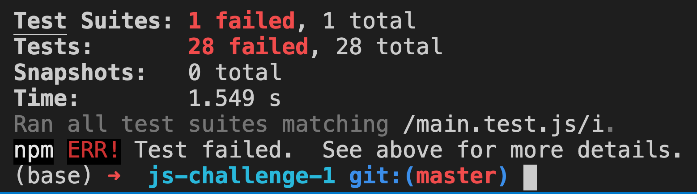

# Code Challenge - Javascript 2

- Over the next few weeks, we will be testing your knowledge on several code concpets to ensure that you understand them.
- These assessments are meant to give you coding practice
- [Instructions](#instructions-to-use)

## Instructions to use

Start Coding - Open the `main.js` file and add your code in the file.

## To Test Your Changes
After you make the changes to the challenges, you can run a test to see if your answers are correct. You can run this as many times as needed until all the tests pass.

```
$ npm test main.test.js
```

#### Failing tests will have red in the final output


#### All passing tests will be green. This means you are completed with this exercise.


## Don't Forget!

HAVE FUN!
